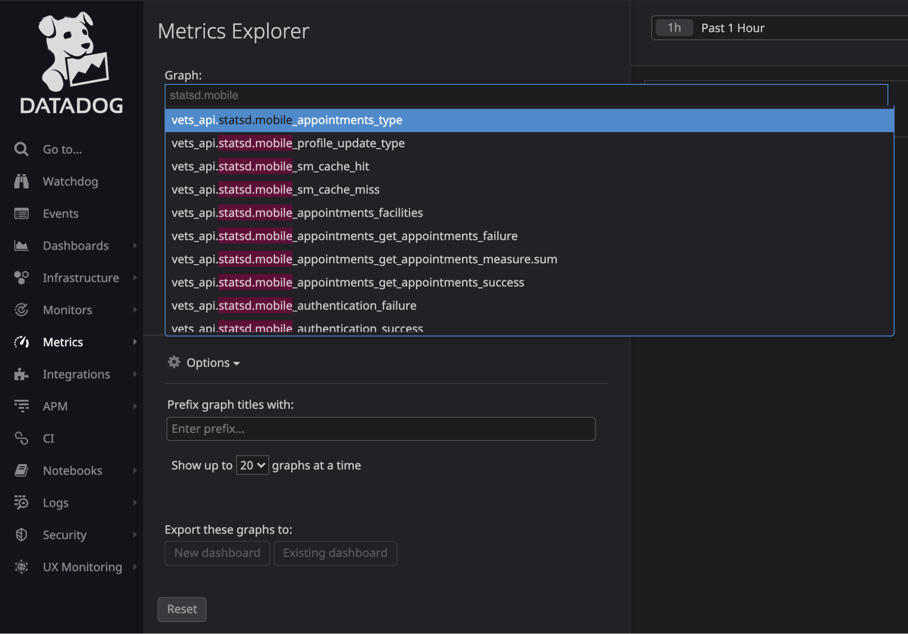
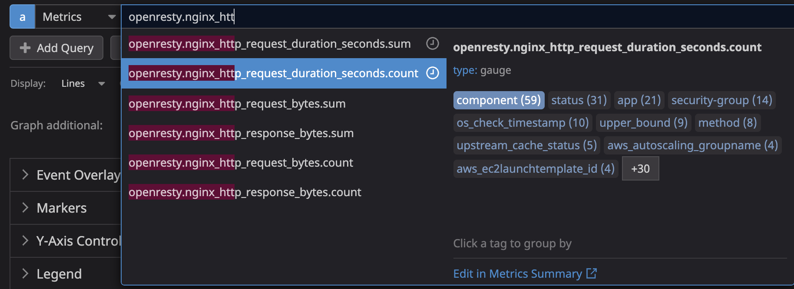
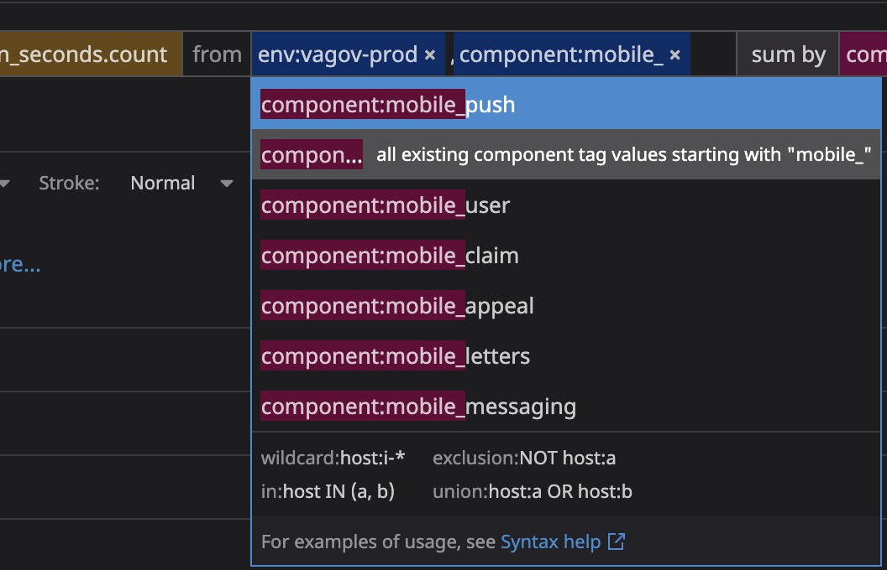
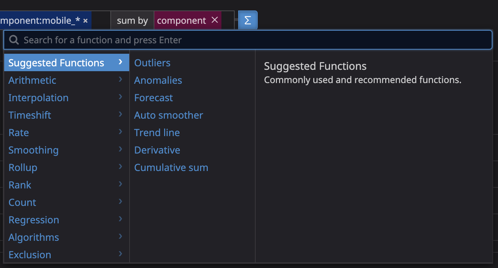
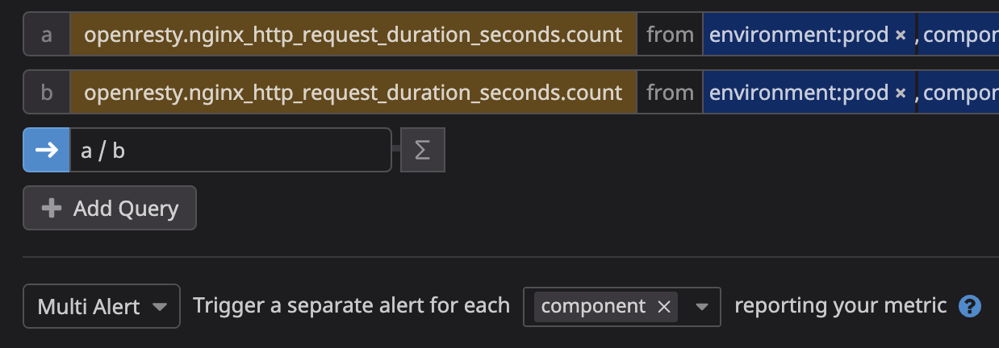
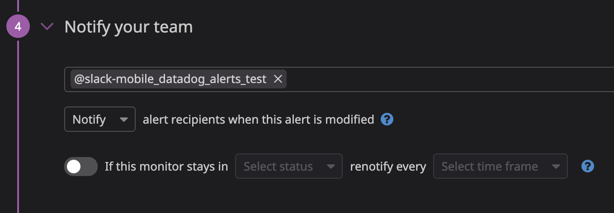

# Datadog

This section will share a short overview of how to use Datadog to analyze, and alert on VA metrics

## Integrations

One of the major Pros of Datadog is a plethora of already created integration steps. [Datadog integration documentation](https://docs.datadoghq.com/getting_started/integrations/)

## Exploring Metrics

You can search for existing metrics using Datadog's explore page. Within Datadog navigate to Metrics -> Explore from the sidebar. Selecting a metric from here will automatically create a graph that can be modified and exported to new or existing dashboards. [Explore documentation](https://docs.datadoghq.com/metrics/explorer/)

## Creating Graphs

1. Navigate to Dashboards -> Quick Graphs or edit a graph from an existing dashboard
2. Choose the metric to graph by searching or selecting it from the dropdown next to 'Metric'

3. Select filters for the metric

4. Decide how to aggregate the metric (Max, Min, Avg, Sum)

5. Apply functions to the metric. [Functions documentation](https://docs.datadoghq.com/dashboards/functions/)

Example: Total requests per second to any mobile endpoint averaged over 5 minutes

## Formulas

You can compare multiple metrics by using formulas.
Example: Request error rate averaged over 5 minutes

## Dashboards

Dashboards allow you to display many different widgets. Select the 'Add widgets' button then select the desired widget. [Widgets documentation](https://docs.datadoghq.com/dashboards/widgets/)

Additionally you can add variables for use across all widgets within a single dashboard. At the top of a dashboard select the pencil icon then fill in the details of your variable. These variables can be accessed from within a widget using `$[variable name]`. [Template variables documentation](https://docs.datadoghq.com/dashboards/template_variables/)

## Creating Alerts

1. Define a metric to alert on. This works the same as discussed in the graphs section above

2. Define alert thresholds. These will dictate when the alert triggers

3. Decide how you would like to be notified when the alert triggers

4. Define message you want to appear when alert triggers

To receive alert messages in slack the Datadog slack tool will need to be added to the channel where you want notifications then the channel also needs to be added via the slack integration within Datadog. Once this is complete the channel will be in a dropdown in the 'Notify your team' section shown above. [Slack integration docs](https://docs.datadoghq.com/integrations/slack/?tab=slackapplication)

## Good Places to Get Started

[Datadog 101 videos](https://www.youtube.com/playlist?list=PLdh-RwQzDsaOoFo0D8xSEHO0XXOKi1-5J) and [Datadog documentation home page](https://docs.datadoghq.com/getting_started/)

## Existing Mobile Dashboards

[Dashboard](https://vagov.ddog-gov.com/apm/services/mobile-app/operations/rack.request/resources?env=eks-prod&panels=qson%3A%28data%3A%28%29%2Cversion%3A%210%29&resources=qson%3A%28data%3A%28visible%3A%21t%2Chits%3A%28selected%3Atotal%29%2Cerrors%3A%28selected%3Atotal%29%2Clatency%3A%28selected%3Ap95%29%2CtopN%3A%215%29%2Cversion%3A%211%29&sort=error-rate%2Cdesc&summary=qson%3A%28data%3A%21f%2Cversion%3A%211%29&view=spans&start=1701356709938&end=1701360309938&paused=false) and [Alerts](https://app.datadoghq.com/monitors/manage?q=mobile). If you have issues accessing the dashboard or the VA Datadog site reach out in the shared mobile slack channel
